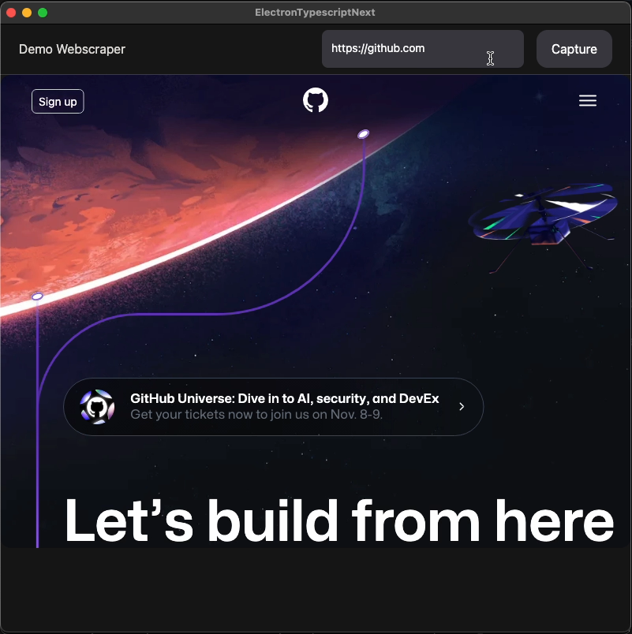

# Webscraper demo

This demo shows you how to use NextJs, Electron, and Puppeteer to fetch and display a screenshot of a webpage.

## Video
[](./demo.mov)

| Part       | Source code (Typescript) | Builds (JavaScript) |
| ---------- | ------------------------ | ------------------- |
| Next.js    | `/renderer`              | `/renderer`         |
| Electron   | `/electron-src`          | `/main`             |
| Production |                          | `/dist`             |

For development it's going to run a HTTP server and let Next.js handle routing. In production it use `output: 'export'` to pre-generate HTML static files and use them in your app instead of running an HTTP server.

## How to use

Execute [`create-next-app`](https://github.com/vercel/next.js/tree/canary/packages/create-next-app) with [npm](https://docs.npmjs.com/cli/init), [Yarn](https://yarnpkg.com/lang/en/docs/cli/create/), or [pnpm](https://pnpm.io) to bootstrap the example:

```bash
npx create-next-app --example with-electron-typescript with-electron-typescript-app
```

```bash
yarn create next-app --example with-electron-typescript with-electron-typescript-app
```

```bash
pnpm create next-app --example with-electron-typescript with-electron-typescript-app
```

Available commands:

```bash
"build-renderer": build and transpile Next.js layer
"build-electron": transpile electron layer
"build": build both layers
"dev": start dev version
"dist": create production electron build
"type-check": check TypeScript in project
```

## Notes

You can create the production app using `npm run dist`.

_note regarding types:_

- Electron provides its own type definitions, so you don't need @types/electron installed!
  source: https://www.npmjs.com/package/@types/electron
- There were no types available for `electron-next` at the time of creating this example, so until they are available there is a file `electron-next.d.ts` in `electron-src` directory.
